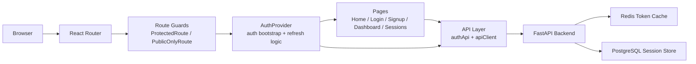
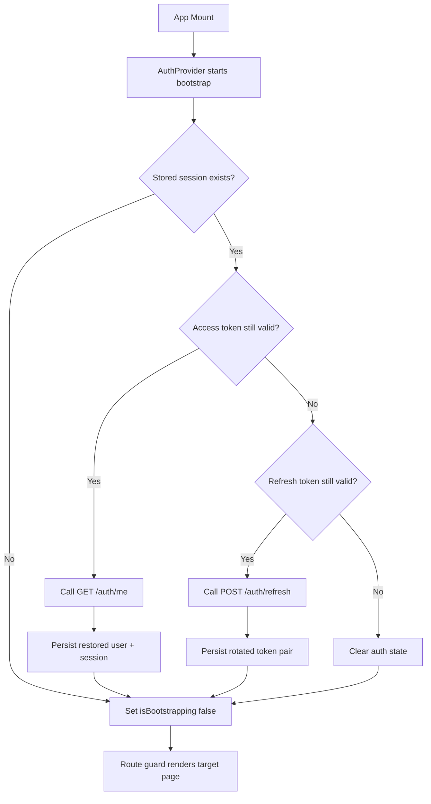
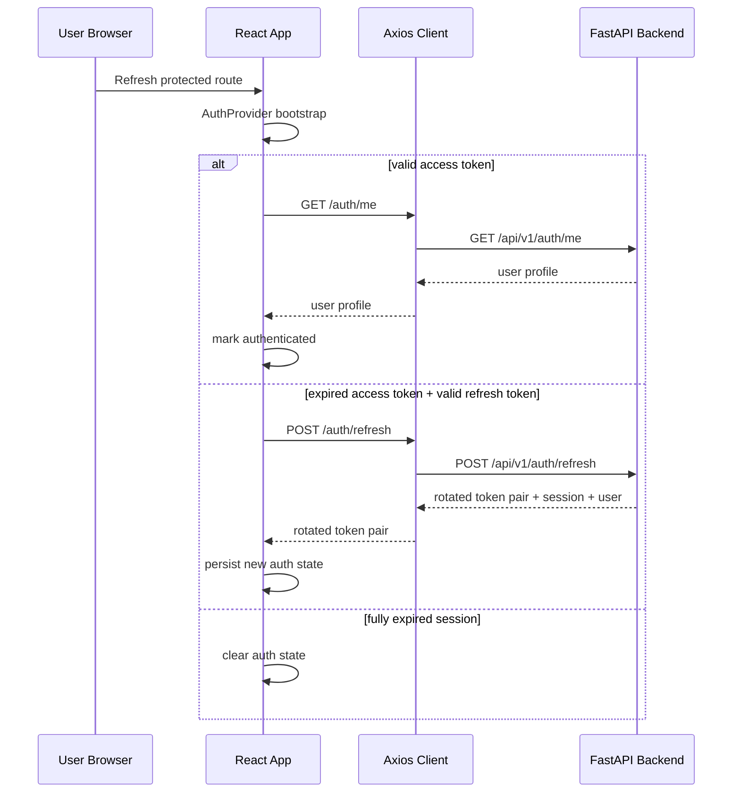

# PDF Chatbot Frontend

React + Vite frontend for the PDF Chatbot platform.

This application provides the browser experience for:

- public marketing and entry pages
- signup and login
- protected app routes
- session restore after browser refresh
- automatic access-token refresh
- authenticated session visibility through `/api/v1/auth/sessions`

The frontend is designed to work with the FastAPI backend in [`pdf-backend-AI-chatbot`](../pdf-backend-AI-chatbot/README.md).

## Table Of Contents

- Overview
- Tech Stack
- Product Features
- Frontend Architecture
- Auth Lifecycle
- Route Map
- Project Structure
- Backend API Contract
- Environment Variables
- Local Development
- Docker Workflow
- Testing And Quality Checks
- Troubleshooting

## Overview

The frontend uses React Router for navigation, Axios for API communication, React Hook Form + Zod for forms and validation, and a small auth state layer built with React context.

The most important behaviors implemented in this project are:

- protected and public-only route guards
- persisted auth session in `localStorage`
- bootstrap restore on page refresh
- automatic retry after `401` with refresh-token rotation
- deduped refresh requests to avoid replaying rotated refresh tokens
- deduped `/auth/sessions` requests in development `StrictMode`
- branded skeleton loading while auth state is being restored

## Tech Stack

- React 18
- Vite 5
- React Router 6
- Axios
- React Hook Form
- Zod
- Vitest
- ESLint

## Product Features

- Login flow aligned with backend device-aware auth
- Signup flow aligned with backend password policy
- Current-user restore through `/api/v1/auth/me`
- Refresh-token rotation through `/api/v1/auth/refresh`
- Logout through `/api/v1/auth/logout`
- Session list page backed by `/api/v1/auth/sessions`
- Full-screen skeleton loading during session bootstrap
- Responsive rose/red themed UI for auth and app surfaces

## Frontend Architecture

The frontend is intentionally small and layered:

- `context/` owns auth state and bootstrap/refresh behavior
- `services/api/` owns Axios clients and HTTP-facing functions
- `routes/` owns route protection logic
- `pages/` own page composition and view-level loading/error states
- `components/` own reusable UI building blocks
- `utils/` own storage, validation, and low-level helpers

### High-Level Architecture



### Frontend Runtime Flow



## Auth Lifecycle

The backend README is the source of truth for token semantics. The frontend is implemented to match that contract.

### Important Backend Rules

- `POST /api/v1/auth/login` returns both `access_token` and `refresh_token`
- `POST /api/v1/auth/refresh` rotates the refresh token every time
- replaying a stale rotated refresh token is treated as suspicious and can revoke the session
- `GET /api/v1/auth/me` validates the current access token

### Frontend Response To Those Rules

- access token is attached automatically by the Axios request interceptor
- `401` responses from protected endpoints trigger a shared refresh request
- concurrent refresh attempts reuse one in-flight promise
- auth bootstrap on page refresh also reuses shared in-flight work
- if refresh cannot recover the session, auth state is cleared and route guards redirect appropriately

### Auth Sequence Diagram



## Route Map

### Public Routes

- `/`
- `/login`
- `/signup`

### Protected Routes

- `/app`
- `/app/sessions`

### Redirect Routes

- `/dashboard` redirects to `/app`
- unknown routes render `NotFoundPage`

## Project Structure

```text
src/
  components/
    common/
    forms/
    layout/
  context/
    AuthContext.jsx
    auth-context.js
  hooks/
    useAuth.js
  pages/
    DashboardPage.jsx
    HomePage.jsx
    LoginPage.jsx
    NotFoundPage.jsx
    SessionsPage.jsx
    SignupPage.jsx
  router/
    index.jsx
  routes/
    ProtectedRoute.jsx
    PublicOnlyRoute.jsx
  services/
    api/
      auth.js
      client.js
  styles/
    index.css
  utils/
    authStorage.js
    device.js
    http.js
    validation.js
```

### Key Files

- [`src/context/AuthContext.jsx`](./src/context/AuthContext.jsx): source of truth for auth state, bootstrap restore, login/logout, and refresh handling
- [`src/services/api/client.js`](./src/services/api/client.js): Axios configuration and `401` refresh retry logic
- [`src/services/api/auth.js`](./src/services/api/auth.js): auth endpoint wrappers
- [`src/routes/ProtectedRoute.jsx`](./src/routes/ProtectedRoute.jsx): blocks unauthenticated access to app routes
- [`src/routes/PublicOnlyRoute.jsx`](./src/routes/PublicOnlyRoute.jsx): redirects authenticated users away from login/signup
- [`src/components/common/FullScreenLoader.jsx`](./src/components/common/FullScreenLoader.jsx): branded skeleton loader used during auth bootstrap

## Backend API Contract

The frontend expects the backend to expose these routes:

### Auth Routes

- `POST /api/v1/auth/signup`
- `POST /api/v1/auth/login`
- `POST /api/v1/auth/refresh`
- `GET /api/v1/auth/me`
- `GET /api/v1/auth/sessions`
- `POST /api/v1/auth/logout`

### Health Route

- `GET /api/v1/health`

### Notes

- signup returns a user profile only, not an authenticated session
- login returns token pair + user + session metadata
- refresh returns a rotated token pair + user + session metadata
- the frontend uses `/auth/sessions` only after authentication

## Environment Variables

The frontend reads environment variables from `src/.env`.

Use [`src/.env.example`](./src/.env.example) as the base template.

| Variable | Purpose |
| --- | --- |
| `VITE_APP_NAME` | Frontend display name |
| `VITE_API_BASE_URL` | Full backend API base URL, for example `http://localhost:8000/api/v1` |

### Example

```env
VITE_APP_NAME=PDF Chatbot
VITE_API_BASE_URL=http://localhost:8000/api/v1
```

## Local Development

### Prerequisites

- Node.js 18+ recommended
- npm
- running backend API with CORS enabled for the frontend origin

### Setup

```bash
cd pdf-AI-chatbot-fe
cp src/.env.example src/.env
npm install
```

Update `src/.env` if your backend is not running on `http://localhost:8000/api/v1`.

### Start Development Server

```bash
npm run dev
```

Default Vite dev URL:

- `http://localhost:5173`

### Common Makefile Commands

```bash
make install
make dev
make lint
make test
make build
make preview
```

## Docker Workflow

The repository includes Docker and Compose support for local frontend development and image builds.

### Development Commands

```bash
make docker-build
make docker-up
make docker-logs
make docker-down
```

### Production Image Build

```bash
make docker-prod-build
```

Notes:

- the local Compose setup reads frontend variables from `src/.env`
- the Vite dev server is exposed on port `5173`

## Testing And Quality Checks

### Run Tests

```bash
npm test
```

### Watch Tests

```bash
npm run test:watch
```

### Run Lint

```bash
npm run lint
```

### Build Production Bundle

```bash
npm run build
```

### Current Coverage Focus

The existing automated tests mainly protect auth behavior:

- storage helpers
- refresh single-flight behavior
- bootstrap completion under `StrictMode`

## Troubleshooting

### Stuck On Loading After Refresh

If the app previously got stuck on the full-screen loader after refreshing a protected route:

- the frontend now uses a shared bootstrap promise in `AuthProvider`
- this prevents React development `StrictMode` from leaving `isBootstrapping` stuck
- if the loader still never exits, inspect backend auth responses and local storage contents

### `/auth/sessions` Called Twice In Development

In React 18 development mode, `StrictMode` intentionally re-runs effects.

To avoid duplicate network traffic:

- the frontend dedupes in-flight `/auth/sessions` requests in `src/services/api/auth.js`

### Refresh Token Rotation Failures

If refresh fails unexpectedly:

- confirm backend and frontend are pointed at the same environment
- confirm `VITE_API_BASE_URL` is correct
- confirm the backend database and Redis state are healthy
- remember the backend rotates refresh tokens on every successful refresh

### CORS Errors

If browser requests fail before reaching the app logic:

- confirm backend CORS is enabled for the frontend origin
- confirm the backend URL includes `/api/v1`

## Relationship To Backend README

For deeper backend implementation details, read:

- [`../pdf-backend-AI-chatbot/README.md`](../pdf-backend-AI-chatbot/README.md)

The backend README covers:

- token validation and rotation rules
- Redis/PostgreSQL auth-session storage model
- API endpoint inventory
- environment configuration
- database and service setup
